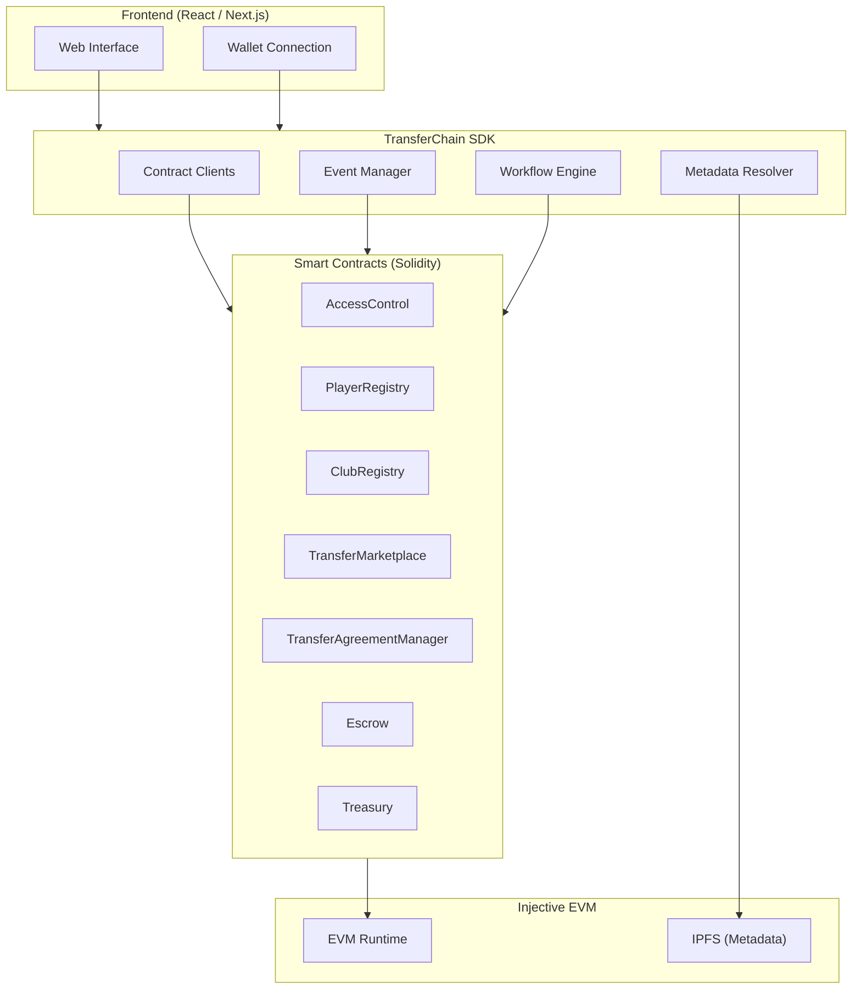

<p align="center">
  
  
  
  
  
  
  
</p>

<h1 align="center">TransferChain</h1>

<p align="center">
  <strong>Decentralized Football Transfer Protocol</strong><br/>
  Transparent, trustless, and efficient football transfers powered by blockchain.
</p>

<p align="center">
  <a href="#features">Features</a> &bull;
  <a href="#architecture">Architecture</a> &bull;
  <a href="#repository-structure">Repositories</a> &bull;
  <a href="#getting-started">Getting Started</a> &bull;
  <a href="#documentation">Docs</a> &bull;
  <a href="#contributing">Contributing</a>
</p>

---

## The Problem

Football transfers remain one of the most opaque and inefficient processes in global sports. The current ecosystem suffers from:

- **Fragmented workflows** — Transfer negotiations involve dozens of intermediaries, each adding friction, cost, and delays.
- **Manual paperwork** — Clubs, agents, and players rely on physical documents, emails, and spreadsheets to track deal progress.
- **Poor transparency** — Transfer fees, agent commissions, and payment schedules are often hidden, leading to disputes and mistrust.
- **Slow settlement** — Cross-border payments can take weeks, with funds locked in intermediary accounts without visibility.
- **Difficult verification** — Verifying player eligibility, registration status, or contract terms requires manual checks across multiple governing bodies.

These problems are not just operational — they undermine the integrity of the sport.

---

## Our Solution

TransferChain replaces the fragmented, trust-dependent football transfer system with a transparent, blockchain-based protocol built on [Injective EVM](https://injective.com/).

### How It Works

1. **Smart Contracts** — Core transfer logic lives on-chain in auditable, permissioned smart contracts. Player and club identities are registered on-chain with metadata stored on IPFS.

2. **Escrow Settlement** — Transfer fees are held in smart contract escrow until all conditions are met. No intermediary controls the funds — the protocol enforces the rules.

3. **Transparent Agreements** — Transfer agreements, including commercial clauses, are recorded immutably on-chain. Every party can verify terms at any time.

4. **Developer SDK** — A type-safe TypeScript SDK provides a clean API for any application to interact with the protocol — no blockchain expertise required.

5. **Modern Frontend** — A React-based web application gives clubs, players, and agents a familiar interface to manage registrations, listings, negotiations, and settlements.

### Key Differentiators

| Traditional Transfers | TransferChain |
|----------------------|---------------|
| Manual paperwork | On-chain smart contracts |
| Centralized intermediaries | Decentralized escrow |
| Poor visibility | Full transparency |
| Days/weeks to settle | Near-instant settlement |
| Hard to verify | Verifiable on-chain |

---

## Architecture



### Layer Descriptions

| Layer | Technology | Responsibility |
|-------|-----------|----------------|
| **Frontend** | React 19, Next.js 16, Tailwind CSS, wagmi, Reown AppKit | User interface, wallet connection, transaction signing |
| **SDK** | TypeScript, ethers.js v6 | Type-safe contract interaction, event handling, workflow orchestration |
| **Smart Contracts** | Solidity 0.8.33, OpenZeppelin, Foundry | Protocol logic, state management, access control, escrow |
| **Blockchain** | Injective EVM | Consensus, finality, on-chain execution |
| **Storage** | IPFS | Player and club metadata, document storage |

---

## Repository Structure

This monorepo contains three independent repositories, each with its own README and development workflow.

### `TransferChain-Contracts`

> Smart contracts that power the TransferChain protocol.

**Purpose** — Implements the core on-chain logic: identity registries, transfer marketplace, agreement management, escrow custody, and protocol treasury.

**Features**

- Role-based access control via OpenZeppelin
- Multi-token escrow support (any ERC-20)
- Modular contract architecture (no hidden state coupling)
- Minimal on-chain state (metadata lives off-chain via URI pointers)
- Unit and integration test suites
- Deployment scripts for local and testnet environments

**Tech Stack**

- Solidity 0.8.33
- Foundry (Forge)
- OpenZeppelin Contracts
- Via IR compilation

**Docs** — [`TransferChain-Contracts/README.md`](./TransferChain-Contracts/README.md)

---

### `TransferChain-SDK`

> Official TypeScript SDK for interacting with the TransferChain protocol.

**Purpose** — Provides a type-safe, framework-agnostic API for applications to read from and write to the TransferChain smart contracts.

**Features**

- Full TypeScript coverage for contracts, events, and errors
- Domain-specific clients for each contract (players, clubs, marketplace, agreements, escrow, treasury)
- Typed event subscriptions and historical queries
- IPFS and HTTP metadata resolution with caching
- Multi-step workflow orchestration (transfers, listings, registrations)
- Tree-shakeable — import only what you use

**Tech Stack**

- TypeScript 5.5
- ethers.js v6
- tsup (bundler)
- Vitest (testing)

**Docs** — [`TransferChain-SDK/README.md`](./TransferChain-SDK/README.md)

---

### `TransferChain-frontend`

> Modern web application for interacting with the TransferChain protocol.

**Purpose** — Delivers a user-facing interface for clubs, players, and agents to register identities, browse listings, negotiate transfers, and manage escrow settlements.

**Features**

- Player and club registration flows
- Marketplace browsing and listing creation
- Wallet connection via Reown AppKit
- Multi-chain wallet support
- IPFS metadata upload and resolution
- Responsive design with Tailwind CSS

**Tech Stack**

- Next.js 16
- React 19
- wagmi + viem
- Reown AppKit
- Tailwind CSS
- TanStack React Query

**Docs** — [`TransferChain-frontend/README.md`](./TransferChain-frontend/README.md)

---

## Features

| Feature | Status |
|---------|--------|
| Player Registry | Complete |
| Club Registry | Complete |
| Transfer Marketplace | Complete |
| Transfer Agreements | Complete |
| Escrow Settlement | Complete |
| Treasury & Protocol Fees | Complete |
| Role-based Access Control | Complete |
| Event System | Complete |
| TypeScript SDK | Complete |
| Type-safe APIs | Complete |
| Wallet Integration | Complete |
| IPFS Metadata | Complete |
| Unit & Integration Tests | Complete |
| Account Abstraction | Planned |
| AI Transfer Insights | Planned |
| Multi-chain Support | Planned |
| Mobile App | Planned |
| Analytics Dashboard | Planned |
| Scout Portal | Planned |
| Agent Portal | Planned |

---

## Technology Stack

### Blockchain

| Component | Technology |
|-----------|-----------|
| Language | Solidity 0.8.33 |
| Framework | Foundry (Forge) |
| Libraries | OpenZeppelin Contracts |
| Network | Injective EVM |
| Testnet Chain ID | 1439 |
| Explorer | [Blockscout](https://testnet.blockscout.injective.network/) |

### Frontend

| Component | Technology |
|-----------|-----------|
| Framework | Next.js 16 |
| UI Library | React 19 |
| Styling | Tailwind CSS 4 |
| Wallet | wagmi + viem + Reown AppKit |
| State | TanStack React Query |
| Language | TypeScript 5 |

### SDK

| Component | Technology |
|-----------|-----------|
| Language | TypeScript 5.5 |
| Blockchain | ethers.js v6 |
| Bundler | tsup |
| Testing | Vitest |
| Linting | ESLint + Prettier |

### Testing

| Component | Technology |
|-----------|-----------|
| Smart Contracts | Foundry (forge test) |
| SDK | Vitest |
| Integration Tests | Foundry + Vitest |

---

## Why Injective?

TransferChain is built on [Injective EVM](https://injective.com/) for several critical reasons:

- **Fast Finality** — Transactions confirm rapidly, enabling near-instant settlement of transfer agreements and escrow releases.
- **Low Fees** — Minimal gas costs make the protocol economically viable for transfers of all sizes, from youth academies to top-tier leagues.
- **EVM Compatibility** — Full Ethereum Virtual Machine support means we leverage the entire Solidity and EVM ecosystem — OpenZeppelin, Foundry, ethers.js — without modification.
- **Developer Tooling** — Injective provides robust RPC infrastructure, block explorers, and deployment tooling that accelerate development and auditing.
- **Scalability** — The network is designed to handle high throughput without congestion, supporting the protocol as it scales globally.

---

## Current Status

### Completed

| Milestone | Details |
|-----------|---------|
| Smart Contracts | 8 modular contracts deployed and verified |
| Testnet Deployment | Injective EVM Testnet (Chain ID 1439) |
| TypeScript SDK | Full SDK with domain clients, events, workflows |
| Frontend MVP | Registration, marketplace, wallet integration |
| Test Coverage | Unit tests for all contracts, integration tests |
| Documentation | Per-repository READMEs and SDK docs |

### Roadmap

| Milestone | Status |
|-----------|--------|
| Account Abstraction | Planned |
| AI Transfer Insights | Planned |
| Multi-chain Support | Planned |
| Mobile App | Planned |
| Analytics Dashboard | Planned |
| Scout Portal | Planned |
| Agent Portal | Planned |
| Mainnet Deployment | Planned |
| Security Audit | Planned |

---

## Getting Started

### Prerequisites

- [Node.js](https://nodejs.org/) >= 18
- [pnpm](https://pnpm.io/)
- [Foundry](https://book.getfoundry.sh/)

### Clone the Repository

```bash
git clone https://github.com/transferchain/TransferChain.git
cd TransferChain
```

### Working with Each Repository

Each repository is self-contained. Choose the one relevant to your work.

#### Smart Contracts

```bash
cd TransferChain-Contracts
forge install
forge build
forge test -vvv
```

#### SDK

```bash
cd TransferChain-SDK
pnpm install
pnpm build
pnpm test:all
```

#### Frontend

```bash
cd TransferChain-frontend
npm install
npm run dev
```

### Which Repository Should I Work On?

| If you want to... | Work in... |
|-------------------|-----------|
| Modify protocol logic or deploy contracts | `TransferChain-Contracts` |
| Build applications using the TransferChain API | `TransferChain-SDK` |
| Contribute to the web interface | `TransferChain-frontend` |

---

## Documentation

| Document | Description |
|----------|-------------|
| [Contracts README](./TransferChain-Contracts/README.md) | Smart contract architecture, deployment, and security model |
| [SDK README](./TransferChain-SDK/README.md) | SDK installation, quick start, and domain clients |
| [SDK Architecture](./TransferChain-SDK/docs/architecture.md) | SDK internal architecture and design decisions |
| [SDK Configuration](./TransferChain-SDK/docs/configuration.md) | SDK configuration options |
| [SDK Public API](./TransferChain-SDK/docs/public-api.md) | Complete API reference |
| [SDK Error Handling](./TransferChain-SDK/docs/error-handling.md) | Error types and handling patterns |
| [Frontend README](./TransferChain-frontend/README.md) | Frontend setup and development |
| [Deployment Manifest](./TransferChain-Contracts/deployments/1439.json) | Deployed contract addresses on Injective Testnet |

---

## Contributing

We welcome contributions from the community. Please follow these guidelines.

### Branch Strategy

- `main` — Production-ready code
- `develop` — Active development target for PRs
- `feature/<name>` — New features
- `fix/<name>` — Bug fixes
- `docs/<name>` — Documentation changes

### Commit Conventions

We follow [Conventional Commits](https://www.conventionalcommits.org/):

```
feat: add player eligibility check
fix: resolve escrow release race condition
docs: update SDK configuration guide
test: add integration tests for marketplace
chore: update OpenZeppelin to v5.1
```

### Pull Request Workflow

1. Fork the repository
2. Create a feature branch from `develop`
3. Make your changes
4. Run tests (`forge test` for contracts, `pnpm test:all` for SDK)
5. Submit a PR against `develop`
6. Ensure CI passes and receive at least one review

### Code Style

- **Solidity**: Follow [Solidity style guide](https://docs.soliditylang.org/en/latest/style-guide.html). Use custom errors over require strings.
- **TypeScript**: Enforced via ESLint and Prettier. Run `pnpm lint` and `pnpm format` before committing.
- **General**: Write tests for all new functionality. Keep PRs focused and small.

### Issue Reporting

- Use [GitHub Issues](https://github.com/transferchain/TransferChain/issues) for bugs and feature requests
- Include reproduction steps for bugs
- Label issues appropriately (`bug`, `enhancement`, `documentation`)

---

## Security

If you discover a security vulnerability in the TransferChain protocol, **do not report it publicly**.

Please follow our responsible disclosure process:

1. **Do not** open a public GitHub issue for security vulnerabilities
2. **Do not** disclose the vulnerability on social media or public channels
3. **Email** the security team directly at the address provided in the repository's `SECURITY.md`
4. **Include** the following in your report:
   - Description of the vulnerability
   - Steps to reproduce
   - Potential impact assessment
   - Suggested fix (if available)

We will acknowledge receipt within 48 hours and work with you to understand and address the issue before any public disclosure.

---

## License

This project is licensed under the **MIT License**.

```
MIT License

Copyright (c) 2025 TransferChain

Permission is hereby granted, free of charge, to any person obtaining a copy
of this software and associated documentation files (the "Software"), to deal
in the Software without restriction, including without limitation the rights
to use, copy, modify, merge, publish, distribute, sublicense, and/or sell
copies of the Software, and to permit persons to whom the Software is
furnished to do so, subject to the following conditions:

The above copyright notice and this permission notice shall be included in all
copies or substantial portions of the Software.

THE SOFTWARE IS PROVIDED "AS IS", WITHOUT WARRANTY OF ANY KIND, EXPRESS OR
IMPLIED, INCLUDING BUT NOT LIMITED TO THE WARRANTIES OF MERCHANTABILITY,
FITNESS FOR A PARTICULAR PURPOSE AND NONINFRINGEMENT. IN NO EVENT SHALL THE
AUTHORS OR COPYRIGHT HOLDERS BE LIABLE FOR ANY CLAIM, DAMAGES OR OTHER
LIABILITY, WHETHER IN AN ACTION OF CONTRACT, TORT OR OTHERWISE, ARISING FROM,
OUT OF OR IN CONNECTION WITH THE SOFTWARE OR THE USE OR OTHER DEALINGS IN THE
SOFTWARE.
```

---

## Team

| Name | Role |
|------|------|
| **Abdulrazak Iliyasu Mafindi** | Team Lead, Smart Contract & SDK Engineer |
| **Akprinciple** | Frontend Developer |
| **Defibns** | Content & Documentation |

---

## Vision

TransferChain aims to become the **infrastructure layer powering transparent football transfers worldwide**.

We are building toward a future where clubs, players, agents, and developers can interact on an open, secure, and scalable protocol — replacing opacity with transparency, intermediaries with code, and friction with efficiency.

The beautiful game deserves a transfer system worthy of it.

---

<p align="center">
  Built with care on <a href="https://injective.com/">Injective EVM</a>.
</p>
