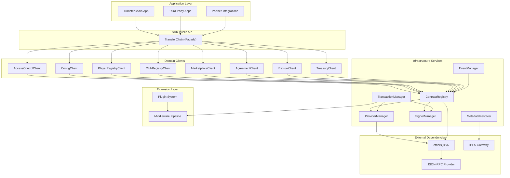

# TransferChain SDK Architecture

> The official TypeScript interface between applications and the TransferChain smart contract protocol.

## Table of Contents

- [Executive Summary](#executive-summary)
- [Vision](#vision)
- [Design Principles](#design-principles)
- [Architecture Overview](#architecture-overview)
- [System Layers](#system-layers)
- [Contract Mapping](#contract-mapping)
- [Technology Stack](#technology-stack)
- [Quick Start](#quick-start)
- [Documentation Map](#documentation-map)

---

## Executive Summary

The TransferChain SDK is the only supported path for interacting with the TransferChain smart contracts. It wraps 8 on-chain contracts (75 functions, 32 events, 41 custom errors) into a typed, framework-agnostic TypeScript library built on ethers.js v6.

Applications never manage blockchain infrastructure directly. No raw ethers.js usage, no ABI imports, no address management, no manual event decoding. The SDK owns all blockchain communication.

Built with TypeScript, pnpm, Vitest, and tsup. Runs in Node.js, browsers, and React Native.

---

## Vision

**Short-term (v1.x):** A complete typed client library for all TransferChain contracts on Injective EVM. Any developer reads on-chain state, submits transactions, subscribes to events, and resolves metadata using a single dependency.

**Mid-term (v2.x):** Multi-chain support for additional EVM-compatible deployments. Account abstraction via ERC-4337. Plugin system for community extensions.

**Long-term:** The canonical interface for football transfer infrastructure on-chain.

---

## Design Principles

| # | Principle | Description |
|---|-----------|-------------|
| 1 | **Applications never touch the chain** | Every blockchain interaction flows through the SDK |
| 2 | **Type safety is non-negotiable** | Every function, event, struct, and error is fully typed |
| 3 | **Predictable API surface** | The API models the domain, not blockchain infrastructure |
| 4 | **Minimal surface area** | Every public export must earn its place |
| 5 | **Tree-shakeable by default** | Consumers pay only for what they use |
| 6 | **Errors are first-class** | Applications never see raw ethers.js errors |
| 7 | **Framework agnostic** | Zero dependencies on React, Next.js, or any runtime |
| 8 | **Forward-compatible** | Multi-chain and AA interfaces exist; implementations ship when needed |

---

## Architecture Overview



---

## System Layers

| Layer | Components | Responsibility |
|-------|-----------|----------------|
| **Presentation** | `TransferChain` facade | Single entry point, consumer-facing API |
| **Domain** | 8 contract clients | Typed wrappers around each smart contract |
| **Infrastructure** | ProviderManager, SignerManager, ContractRegistry, TransactionManager, EventManager, MetadataResolver | Blockchain communication, caching, error normalization |
| **Extension** | Middleware, Plugins | Cross-cutting concerns, extensibility |
| **External** | ethers.js v6, JSON-RPC, IPFS | Third-party dependencies |

---

## Contract Mapping

| Smart Contract | SDK Client | Read Methods | Write Methods |
|----------------|-----------|-------------|---------------|
| TransferChainAccessControl | `AccessControlClient` | `getRoles()`, `hasRole()`, `isPaused()` | `grantRole()`, `revokeRole()`, `pause()`, `unpause()` |
| TransferChainConfig | `ConfigClient` | `getConfig()`, `getTreasury()`, `getMarketplaceFee()`, `isProtocolOperational()`, `isPaymentTokenSupported()` | `setTreasury()`, `setMarketplaceFee()`, `setEmergencyMode()`, `addPaymentToken()`, `removePaymentToken()` |
| PlayerRegistry | `PlayerRegistryClient` | `getPlayer()`, `getPlayerOwner()`, `getNextPlayerId()` | `registerPlayer()`, `updatePlayerMetadata()`, `setPlayerStatus()` |
| ClubRegistry | `ClubRegistryClient` | `getClub()`, `getClubOwner()`, `getNextClubId()` | `registerClub()`, `updateClubMetadata()`, `setClubStatus()` |
| TransferMarketplace | `MarketplaceClient` | `getListing()`, `getOffer()`, `getNextListingId()` | `createListing()`, `cancelListing()`, `makeOffer()`, `rejectOffer()` |
| TransferAgreementManager | `AgreementClient` | `getAgreement()`, `getNextAgreementId()` | `createAgreement()`, `approveAgreement()`, `rejectAgreement()` |
| Escrow | `EscrowClient` | `getDeposit()`, `getNextDepositId()` | `deposit()`, `release()`, `refund()` |
| Treasury | `TreasuryClient` | `getBalance()`, `getTokenBalance()`, `getOwner()` | `depositToken()`, `withdrawToken()` |

---

## Technology Stack

| Component | Technology | Version |
|-----------|-----------|---------|
| Language | TypeScript | 5.x |
| Runtime | Node.js | 18+ |
| Ethereum Library | ethers.js | v6 |
| Package Manager | pnpm | 9+ |
| Bundler | tsup | 8.x |
| Test Framework | Vitest | 3.x |
| Linter | ESLint | 9.x |
| Formatter | Prettier | 3.x |
| Target Chain | Injective EVM | — |
| Token Standard | ERC-20 | — |

---

## Quick Start

### Initialize the SDK

```typescript
import { TransferChain } from "@transferchain/sdk";

const tc = new TransferChain({
  chainId: 8888,
  rpcUrl: "https://evm.injective.network",
  privateKey: "0x...",
});
```

### Read on-chain state

```typescript
const player = await tc.players.getPlayer("0xBEEF...");
console.log(player.name, player.status);
```

### Submit a transaction

```typescript
const result = await tc.marketplace.createListing({
  seller: "0xBEEF...",
  playerId: 1n,
  clubId: 1n,
  price: 1000n * 10n ** 18n,
  metadataUri: "ipfs://Qm...",
});

console.log(`Listing #${result.events[0].listingId} created`);
```

### Subscribe to events

```typescript
const unsubscribe = tc.events.subscribe("ListingCreated", (event) => {
  console.log(`New listing by ${event.seller}`);
});
```

---

## Documentation Map

| Document | Description |
|----------|-------------|
| [Configuration](./configuration.md) | SDK initialization, deployment manifests, environment variables |
| [Repository](./repository.md) | Folder structure, naming conventions, ABI generation |
| [Public API](./public-api.md) | API design philosophy, naming conventions, type mappings |
| [Provider System](./provider-system.md) | Provider lifecycle, caching, validation |
| [Wallet System](./wallet-system.md) | Signer management, read-only mode, account abstraction |
| [Transaction Flow](./transaction-flow.md) | Transaction pipeline, error recovery, simulation |
| [Event System](./event-system.md) | Typed events, subscriptions, historical queries |
| [Metadata Layer](./metadata-layer.md) | IPFS resolution, pluggable protocols, metadata schemas |
| [Middleware](./middleware.md) | Middleware pipeline, built-in middleware, custom middleware |
| [Plugin System](./plugin-system.md) | Plugin interface, lifecycle, restrictions |
| [Cache Architecture](./cache-architecture.md) | Cache layers, TTL, bypass, design principles |
| [Error Handling](./error-handling.md) | Error hierarchy, normalization, error codes |
| [Logger](./logger.md) | Logger interface, injection, what gets logged |
| [Network Layer](./network-layer.md) | Provider requirements, validation, WebSocket support |
| [Testing](./testing.md) | Unit, integration, E2E strategy, coverage targets |
| [Contributing](./contributing.md) | Dev setup, PR process, code style |
| [Roadmap](./roadmap.md) | Phases 1-5, versioning, breaking changes |
| [ADR Index](./adr/index.md) | Architecture Decision Records |
