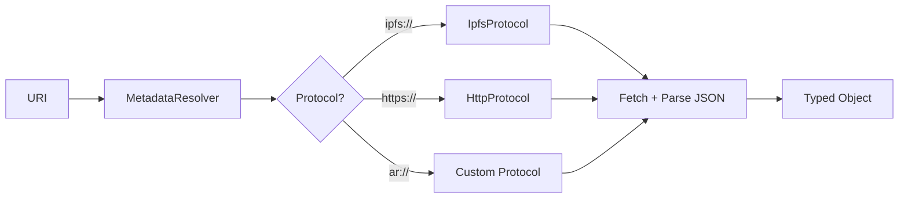

# Metadata Layer

## Table of Contents

- [Architecture](#architecture)
- [Protocol Handler Interface](#protocol-handler-interface)
- [Built-In Handlers](#built-in-handlers)
- [MetadataResolver](#metadataresolver)
- [Player Metadata](#player-metadata)
- [Club Metadata](#club-metadata)
- [Extensibility](#extensibility)
- [Caching](#caching)
- [Forward Compatibility](#forward-compatibility)

---

## Architecture

The metadata layer resolves off-chain metadata URIs into typed JavaScript objects. It is decoupled from the contract layer — you can use metadata resolution without any blockchain interaction.



---

## Protocol Handler Interface

```typescript
interface ProtocolHandler {
  /** The URI scheme this handler supports (e.g., "ipfs", "https") */
  readonly scheme: string;

  /** Resolve a URI to its content */
  resolve(uri: string, options?: ResolveOptions): Promise<MetadataContent>;
}

interface ResolveOptions {
  /** Skip the metadata cache */
  skipCache?: boolean;

  /** Request timeout in milliseconds */
  timeout?: number;
}

interface MetadataContent {
  /** The parsed JSON content */
  data: Record<string, unknown>;

  /** The final resolved URL (after redirects) */
  resolvedUrl: string;

  /** Content hash for cache keying */
  hash: string;
}
```

---

## Built-In Handlers

### IpfsProtocol

Resolves `ipfs://` URIs by delegating to a configurable IPFS gateway.

| Property | Default |
|----------|---------|
| Scheme | `ipfs` |
| Gateway | `https://ipfs.io/ipfs/` |
| Timeout | 10,000ms |

```typescript
// ipfs://QmHash... → https://ipfs.io/ipfs/QmHash...
```

### HttpProtocol

Resolves `https://` and `http://` URIs via standard HTTP fetch.

| Property | Default |
|----------|---------|
| Schemes | `https`, `http` |
| Timeout | 10,000ms |
| Retry | 1 attempt on network error |

---

## MetadataResolver

The `MetadataResolver` is a URI protocol handler registry:

```typescript
class MetadataResolver {
  /** Register a protocol handler */
  registerHandler(handler: ProtocolHandler): void;

  /** Resolve a URI to a typed object */
  resolve<T>(uri: string, options?: ResolveOptions): Promise<T>;

  /** Resolve a player metadata URI */
  resolvePlayer(uri: string, options?: ResolveOptions): Promise<PlayerProfile>;

  /** Resolve a club metadata URI */
  resolveClub(uri: string, options?: ResolveOptions): Promise<ClubProfile>;
}
```

### Usage

```typescript
// Generic resolution
const data = await tc.metadata.resolve<Record<string, unknown>>("ipfs://Qm...");

// Typed resolution
const player = await tc.metadata.resolvePlayer("ipfs://Qm...");
console.log(player.name, player.nationality);
```

---

## Player Metadata

### Schema

```typescript
interface PlayerProfile {
  name: string;
  age?: number;
  nationality?: string;
  preferredFoot?: "left" | "right" | "both";
  position?: string;
  height?: number;
  currentClub?: string;
  photoUri?: string;
  highlightVideoUris?: string[];
  socialLinks?: Record<string, string>;
  achievements?: string[];

  /** Forward-compatible: additional fields are preserved */
  [key: string]: unknown;
}
```

### Fetching

```typescript
// Via the metadata resolver
const profile = await tc.metadata.resolvePlayer("ipfs://Qm...");
```

---

## Club Metadata

### Schema

```typescript
interface ClubProfile {
  name: string;
  country?: string;
  city?: string;
  league?: string;
  logoUri?: string;
  website?: string;
  verified?: boolean;
  description?: string;
  socialLinks?: Record<string, string>;

  /** Forward-compatible: additional fields are preserved */
  [key: string]: unknown;
}
```

### Fetching

```typescript
const profile = await tc.metadata.resolveClub("ipfs://Qm...");
console.log(profile.name, profile.league);
```

---

## Extensibility

Register custom protocol handlers at SDK initialization:

```typescript
import { TransferChain, MetadataResolver } from "@transferchain/sdk";

const resolver = new MetadataResolver();
resolver.registerHandler({
  scheme: "ar",
  resolve: async (uri) => {
    // Arweave resolution logic
    const data = await fetchFromArweave(uri);
    return { data, resolvedUrl: uri, hash: computeHash(data) };
  },
});

const tc = new TransferChain({
  chainId: 8888,
  rpcUrl: "...",
  metadata: { resolver },
});
```

### Handler Priority

Handlers are matched by scheme. If multiple handlers are registered for the same scheme, the most recently registered handler wins.

---

## Caching

### Cache Properties

| Property | Value |
|----------|-------|
| Scope | Per `TransferChain` instance |
| Key | URI string |
| TTL | 5 minutes (configurable) |
| Max entries | 1000 (configurable) |
| Eviction | LRU (Least Recently Used) |

### Cache Bypass

Skip the cache when freshness is critical:

```typescript
const profile = await tc.metadata.resolvePlayer("ipfs://Qm...", {
  skipCache: true,
});
```

### Why Cache Metadata But Not Contract Reads

- IPFS gateways have rate limits and high latency (500ms+)
- Off-chain metadata changes infrequently (player profiles, club details)
- On-chain state changes with every block — caching would risk stale data

---

## Forward Compatibility

Metadata schemas use index signatures to accept unknown fields:

```typescript
interface PlayerProfile {
  name: string;
  // ... known fields
  [key: string]: unknown;  // Accepts future fields without breaking
}
```

This means:

- New metadata fields added to IPFS documents are preserved, not rejected
- The SDK does not need updating when the metadata schema evolves
- Consumers can access unknown fields via string indexing
