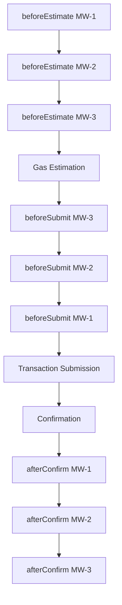

# Middleware

## Table of Contents

- [Purpose](#purpose)
- [Middleware Interface](#middleware-interface)
- [Transaction Context](#transaction-context)
- [Execution Order](#execution-order)
- [Built-In Middleware](#built-in-middleware)
- [Default Behavior](#default-behavior)
- [Writing Custom Middleware](#writing-custom-middleware)

---

## Purpose

Middleware intercepts the transaction pipeline at defined points, allowing cross-cutting concerns (logging, gas optimization, analytics) without modifying domain clients.

See [ADR-0008](./adr/0008-middleware-onion-model.md) for the onion model rationale.

---

## Middleware Interface

```typescript
interface Middleware {
  /** Unique identifier for this middleware */
  readonly name: string;

  /** Called before gas estimation */
  beforeEstimate?(ctx: TransactionContext): Promise<void> | void;

  /** Called after gas estimation, before transaction submission */
  beforeSubmit?(ctx: TransactionContext): Promise<void> | void;

  /** Called after transaction confirmation */
  afterConfirm?(ctx: TransactionContext, receipt: TransactionReceipt): Promise<void> | void;

  /** Called on any error in the pipeline */
  onError?(ctx: TransactionContext, error: Error): Promise<void> | void;
}
```

All hooks are optional. A middleware only implements the hooks it needs.

---

## Transaction Context

The context object is passed through the entire middleware chain:

```typescript
interface TransactionContext {
  /** The contract name (e.g., "playerRegistry") */
  contractName: string;

  /** The function name (e.g., "registerPlayer") */
  functionName: string;

  /** The function arguments */
  args: unknown[];

  /** Transaction overrides (mutable by middleware) */
  overrides: TransactionOverrides;

  /** The target chain ID */
  chainId: number;

  /** The sender address (if a signer is available) */
  sender?: string;

  /** Shared state bag for middleware communication */
  state: Record<string, unknown>;
}
```

### State Bag

The `state` property is an empty object shared across all middleware in a single transaction. Middleware can use it to pass data between `before*` and `after*` hooks.

```typescript
const timingMiddleware: Middleware = {
  name: "timing",
  beforeEstimate: (ctx) => {
    ctx.state.startTime = Date.now();
  },
  afterConfirm: (ctx) => {
    const elapsed = Date.now() - (ctx.state.startTime as number);
    console.log(`${ctx.functionName} completed in ${elapsed}ms`);
  },
};
```

---

## Execution Order

Middleware follows the onion model (see [ADR-0008](./adr/0008-middleware-onion-model.md)):



- **`before*` hooks:** Execute in registration order (MW-1 → MW-2 → MW-3)
- **`after*` hooks:** Execute in reverse registration order (MW-3 → MW-2 → MW-1)

This ensures cleanup in `after*` hooks can reference state from the corresponding `before*` hooks.

---

## Built-In Middleware

### GasEstimationMiddleware

Adds a configurable buffer to gas estimates.

```typescript
const gasMiddleware = new GasEstimationMiddleware({
  bufferPercentage: 20n,  // Add 20% buffer (default)
});
```

**Hook:** `beforeEstimate` — multiplies the estimated gas by `(100 + bufferPercentage) / 100`.

### LoggingMiddleware

Logs transaction lifecycle events to the configured `Logger`.

```typescript
const loggingMiddleware = new LoggingMiddleware({
  logLevel: "info",
  includeArgs: false,  // Don't log function arguments (privacy)
});
```

**Hooks:** All four hooks — logs timing, gas estimates, TX hash, and errors.

---

## Default Behavior

If no middleware is provided, the transaction pipeline runs without interception. The SDK does not inject hidden middleware.

```typescript
const tc = new TransferChain({
  chainId: 8888,
  rpcUrl: "...",
  // No middleware — clean pipeline
});
```

---

## Writing Custom Middleware

### Example: Analytics Middleware

```typescript
import type { Middleware, TransactionContext } from "@transferchain/sdk";

const analyticsMiddleware: Middleware = {
  name: "analytics",

  beforeSubmit: async (ctx) => {
    await analytics.track("tx_submitted", {
      contract: ctx.contractName,
      function: ctx.functionName,
      chain: ctx.chainId,
    });
  },

  afterConfirm: async (ctx, receipt) => {
    await analytics.track("tx_confirmed", {
      contract: ctx.contractName,
      function: ctx.functionName,
      gasUsed: receipt.gasUsed.toString(),
    });
  },

  onError: async (ctx, error) => {
    await analytics.track("tx_failed", {
      contract: ctx.contractName,
      function: ctx.functionName,
      error: error.message,
    });
  },
};
```

### Example: Nonce Management Middleware

```typescript
const nonceMiddleware: Middleware = {
  name: "nonce-management",

  beforeSubmit: async (ctx) => {
    // Override nonce for high-throughput scenarios
    if (ctx.state.customNonce !== undefined) {
      ctx.overrides.nonce = ctx.state.customNonce as number;
    }
  },
};
```

### Registration

Register middleware at SDK initialization:

```typescript
const tc = new TransferChain({
  chainId: 8888,
  rpcUrl: "...",
  middleware: [gasMiddleware, loggingMiddleware, analyticsMiddleware],
});
```
