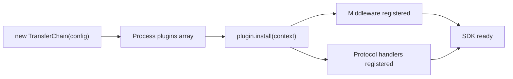

# Plugin System

## Table of Contents

- [Plugin Interface](#plugin-interface)
- [PluginContext](#plugincontext)
- [Plugin Lifecycle](#plugin-lifecycle)
- [Plugin Restrictions](#plugin-restrictions)
- [Example Plugin](#example-plugin)

---

## Plugin Interface

```typescript
interface Plugin {
  /** Unique plugin identifier (e.g., "transferchain-analytics") */
  readonly name: string;

  /** SemVer version string (e.g., "1.0.0") */
  readonly version: string;

  /** Called once during SDK initialization */
  install(context: PluginContext): void;
}
```

---

## PluginContext

The context provided to plugins during installation:

```typescript
interface PluginContext {
  /** Register a middleware for the transaction pipeline */
  useMiddleware(middleware: Middleware): void;

  /** Register a metadata protocol handler */
  useProtocol(handler: ProtocolHandler): void;

  /** Access the contract registry (read-only) */
  readonly contractRegistry: IContractRegistry;

  /** Access the event manager */
  readonly eventManager: IEventManager;

  /** Register a logger */
  setLogger(logger: Logger): void;
}
```

### What Plugins Can Do

| Capability | Method |
|-----------|--------|
| Add transaction middleware | `useMiddleware()` |
| Add metadata protocol handlers | `useProtocol()` |
| Read contract addresses | `contractRegistry.getAddress()` |
| Subscribe to events | `eventManager.subscribe()` |
| Replace the logger | `setLogger()` |

---

## Plugin Lifecycle



### Order

1. Core services are created (ProviderManager, SignerManager, etc.)
2. Domain clients are instantiated
3. Plugins are processed in array order
4. Each plugin's `install()` method is called
5. The SDK is fully initialized

### Timing

- Plugins execute during construction, before the first RPC call
- Plugins cannot be added or removed after construction
- Plugin execution order follows the `plugins` array order

---

## Plugin Restrictions

Plugins have access to middleware, protocol handlers, the read-only contract registry, and the event manager. They **cannot**:

| Restriction | Reason |
|------------|--------|
| Replace the provider | Provider is immutable after construction |
| Replace the signer | Signer is immutable after construction |
| Modify the address registry | Addresses are a core security concern |
| Access internal services | ProviderManager, SignerManager are not exposed |
| Override other plugins | Plugins are independent; no inter-plugin dependency |
| Modify the SDK config | Config is frozen after construction |

These restrictions ensure plugins cannot break the SDK's safety guarantees.

---

## Example Plugin

```typescript
import type { Plugin, PluginContext } from "@transferchain/sdk";

const transferchainAnalyticsPlugin: Plugin = {
  name: "transferchain-analytics",
  version: "1.0.0",

  install(context: PluginContext): void {
    // Register analytics middleware
    context.useMiddleware({
      name: "analytics",
      afterConfirm: async (ctx, receipt) => {
        await sendAnalytics({
          event: "transaction",
          contract: ctx.contractName,
          function: ctx.functionName,
          gasUsed: receipt.gasUsed.toString(),
          status: receipt.status,
        });
      },
    });

    // Log plugin installation
    context.setLogger({
      debug: () => {},
      info: (msg) => console.log(`[analytics] ${msg}`),
      warn: (msg) => console.warn(`[analytics] ${msg}`),
      error: (msg) => console.error(`[analytics] ${msg}`),
    });
  },
};
```

### Registration

```typescript
const tc = new TransferChain({
  chainId: 8888,
  rpcUrl: "...",
  plugins: [transferchainAnalyticsPlugin],
});
```
