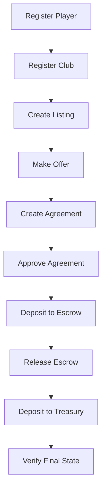

# Testing Strategy

## Table of Contents

- [Testing Tiers](#testing-tiers)
- [Unit Tests](#unit-tests)
- [Integration Tests](#integration-tests)
- [End-to-End Tests](#end-to-end-tests)
- [Test Helpers](#test-helpers)
- [Coverage Targets](#coverage-targets)
- [CI Test Commands](#ci-test-commands)

---

## Testing Tiers

| Tier | Framework | Environment | What | Speed |
|------|-----------|-------------|------|-------|
| Unit | Vitest | Node.js | Individual functions with mocked providers | < 100ms per test |
| Integration | Vitest | Anvil (local fork) | SDK methods against real contracts | < 5s per test |
| E2E | Vitest | Anvil + full protocol | Complete transfer workflows | < 30s per test |

---

## Unit Tests

### Principles

- Every public method in every domain client has at least one unit test
- Providers and contracts are mocked (no real RPC calls)
- Tests verify: input validation, error handling, return types, event decoding
- Tests are fast (< 100ms each)

### What to Test

| Area | Test Cases |
|------|-----------|
| Input validation | Valid inputs pass, invalid inputs throw `ValidationError` |
| Error normalization | Raw errors are converted to typed SDK errors |
| Return types | Results match expected TypeScript types |
| Event decoding | Raw logs are decoded into typed events |
| Configuration | Invalid config throws at first use, not construction |
| Read-only mode | Write methods throw `SIGNER_REQUIRED` |

### Mock Strategy

```typescript
// Mock provider
const mockProvider = createMockProvider({
  chainId: 8888,
  blockNumber: 1000,
});

// Mock contract
const mockContract = createMockContract({
  getPlayer: vi.fn().mockResolvedValue(mockPlayer),
});

// Inject mocks
const tc = new TransferChain({
  provider: mockProvider,
});
```

---

## Integration Tests

### Principles

- Each test deploys all 8 contracts to Anvil
- Tests follow the real contract interaction flow
- Tests verify: end-to-end reads and writes, event emission, error recovery
- Anvil is managed by `tests/helpers/anvil.ts`

### Test Setup

```typescript
import { deployProtocol } from "../helpers/deploy";
import { createTestProvider } from "../helpers/anvil";

let provider: ethers.JsonRpcProvider;
let deployer: ethers.Wallet;
let protocol: DeployedProtocol;

beforeAll(async () => {
  provider = await createTestProvider();
  deployer = new ethers.Wallet(TEST_PRIVATE_KEY, provider);
  protocol = await deployProtocol(deployer);
});
```

### Test Scenarios

Each domain client has integration tests covering:

| Client | Integration Test Scenarios |
|--------|--------------------------|
| PlayerRegistryClient | Register, query, update metadata, set status |
| ClubRegistryClient | Register, query, update metadata, set status |
| MarketplaceClient | Create listing, cancel, make offer, reject offer |
| AgreementClient | Create, approve, reject |
| EscrowClient | Deposit, release, refund |
| TreasuryClient | Deposit token, withdraw token |
| ConfigClient | Get/set config, payment tokens, emergency mode |
| AccessControlClient | Grant/revoke roles, pause/unpause |

---

## End-to-End Tests

### Full Protocol Flow

The E2E test mirrors the Solidity integration test from `TransferChain-Contracts`:



### Assertions at Each Step

| Step | Assertion |
|------|-----------|
| Register Player | Player exists, status is Active |
| Register Club | Club exists, status is Verified |
| Create Listing | Listing exists, status is Active |
| Make Offer | Offer exists, status is Pending |
| Create Agreement | Agreement exists, status is Draft |
| Approve Agreement | Agreement status is Approved |
| Deposit to Escrow | Deposit exists, status is Funded |
| Release Escrow | Deposit status is Released, payee received funds |
| Deposit to Treasury | Treasury balance increased |

---

## Test Helpers

### `tests/helpers/anvil.ts`

Manages the Anvil process lifecycle:

```typescript
import { startAnvil, stopAnvil } from "./helpers/anvil";

// Start Anvil on a random port
const port = await startAnvil();

// Stop Anvil when tests complete
afterAll(() => stopAnvil());
```

### `tests/helpers/deploy.ts`

Deploys all 8 contracts to the local Anvil instance:

```typescript
import { deployProtocol } from "./helpers/deploy";

const protocol = await deployProtocol(deployer);
// protocol.accessControl, protocol.config, protocol.players, etc.
```

### `tests/helpers/wallets.ts`

Provides test wallet fixtures with pre-funded accounts:

```typescript
import { testWallets, deployerWallet } from "./helpers/wallets";
// deployerWallet: pre-funded with 100 ETH
// testWallets: array of 10 pre-funded test wallets
```

### `tests/helpers/mock-provider.ts`

Creates mock providers for unit tests:

```typescript
import { createMockProvider } from "./helpers/mock-provider";

const provider = createMockProvider({
  chainId: 8888,
  blockNumber: 1000,
});
```

---

## Coverage Targets

| Module | Target |
|--------|--------|
| Core (ProviderManager, ContractRegistry, TransactionManager) | 95% |
| Contract clients | 90% |
| Events | 90% |
| Metadata | 85% |
| Errors | 100% |
| Utils | 100% |
| **Overall** | **90%** |

---

## CI Test Commands

```bash
# Unit tests only (fast, no Anvil needed)
pnpm test:unit

# Integration tests (requires Anvil binary)
pnpm test:integration

# All tests
pnpm test:all

# Coverage report
pnpm test:coverage

# Watch mode for development
pnpm test:watch
```

### CI Pipeline

```yaml
# .github/workflows/ci.yml
jobs:
  test:
    runs-on: ubuntu-latest
    steps:
      - uses: actions/checkout@v4
      - uses: pnpm/action-setup@v2
      - uses: actions/setup-node@v4
        with:
          node-version: 20
      - run: pnpm install
      - run: pnpm lint
      - run: pnpm typecheck
      - run: pnpm test:unit
      - run: pnpm build
```
