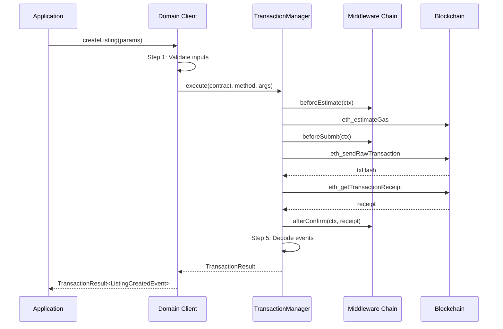

# Transaction Flow

## Table of Contents

- [Pipeline Overview](#pipeline-overview)
- [Step 1: Input Validation](#step-1-input-validation)
- [Step 2: Gas Estimation](#step-2-gas-estimation)
- [Step 3: Transaction Submission](#step-3-transaction-submission)
- [Step 4: Confirmation](#step-4-confirmation)
- [Step 5: Event Decoding](#step-5-event-decoding)
- [Step 6: Result Assembly](#step-6-result-assembly)
- [Transaction Defaults](#transaction-defaults)
- [Error Recovery](#error-recovery)
- [Transaction Simulation](#transaction-simulation)

---

## Pipeline Overview

Every write operation follows a six-step pipeline:



---

## Step 1: Input Validation

The domain client validates all inputs before any RPC call. This is the cheapest form of error detection.

### Validation Rules

| Input Type | Rule | Error |
|-----------|------|-------|
| Ethereum address | `ethers.isAddress()`, checksum enforced | `INVALID_ADDRESS` |
| Required amount | `> 0n` | `INVALID_AMOUNT` |
| Price | `> 0n` | `INVALID_PRICE` |
| Metadata URI | Non-empty string, length >= 5 | `INVALID_METADATA_URI` |
| Entity ID | `> 0n` (0 is reserved as "not found") | `LISTING_NOT_FOUND` / etc. |

### Why Before RPC

- Input validation is instant (no network latency)
- Prevents unnecessary gas estimation for invalid inputs
- Provides clear, specific error messages

---

## Step 2: Gas Estimation

The `TransactionManager` estimates gas via `eth_estimateGas`:

```typescript
const gasEstimate = await contract.functionName.estimateGas(args, overrides);
```

### Middleware Integration

The middleware chain can modify the estimate:

1. `GasEstimationMiddleware` adds a configurable buffer (default: 20%)
2. Custom middleware can override with fixed values or complex logic

### Failure Handling

If estimation fails (transaction would revert), a `TransactionError` with code `GAS_ESTIMATION_FAILED` is thrown before any gas is spent.

---

## Step 3: Transaction Submission

The transaction is sent via `eth_sendRawTransaction`:

```typescript
const tx = await contract.functionName.sendTransaction(args, overrides);
const txHash = tx.hash;
```

### Overrides

The middleware chain can inject transaction overrides:

```typescript
const overrides = {
  gasLimit: adjustedGasEstimate,
  maxFeePerGas: config.maxFeePerGas,
  maxPriorityFeePerGas: config.maxPriorityFeePerGas,
  customData: { /* AA paymaster data, etc. */ },
};
```

### Failure Handling

If submission fails, a `TransactionError` with code `SUBMISSION_FAILED` is thrown.

---

## Step 4: Confirmation

The `TransactionManager` waits for the transaction receipt:

```typescript
const receipt = await tx.wait(confirmations);
```

### Default Behavior

- **Confirmations:** 1 (wait for 1 block confirmation)
- **Timeout:** 120,000ms (2 minutes)
- **Polling interval:** Uses provider's default

### Configurable

```typescript
const tc = new TransferChain({
  transactions: {
    confirmations: 2,    // Wait for 2 block confirmations
    timeout: 300000,     // 5 minutes
  },
});
```

### Failure Handling

If confirmation times out, a `TransactionError` with code `CONFIRMATION_TIMEOUT` is thrown. The transaction hash is preserved in the error for manual inspection.

---

## Step 5: Event Decoding

All logs from the transaction receipt are decoded using the contract's ABI:

```typescript
const iface = contract.interface;
const events = receipt.logs
  .map(log => {
    try {
      return iface.parseLog(log);
    } catch {
      return null;
    }
  })
  .filter(Boolean)
  .filter(event => event.name === expectedEventName);
```

### Typed Results

Events are mapped to their typed counterparts using the `ContractEventMap` (see [Event System](./event-system.md)).

---

## Step 6: Result Assembly

The `TransactionResult<T>` is constructed and returned:

```typescript
return {
  txHash: receipt.hash,
  receipt,
  events: decodedEvents as T[],
};
```

---

## Transaction Defaults

Configurable default parameters:

```typescript
interface TransactionDefaults {
  /** Confirmations to wait (default: 1) */
  confirmations?: number;

  /** Timeout in ms (default: 120000) */
  timeout?: number;

  /** Gas buffer percentage (default: 20%) */
  gasBuffer?: bigint;

  /** Override maxFeePerGas */
  maxFeePerGas?: bigint;

  /** Override maxPriorityFeePerGas */
  maxPriorityFeePerGas?: bigint;
}
```

---

## Error Recovery

### TX Reverted On-Chain

If the transaction is mined but reverts:

1. `receipt.status === 0` indicates failure
2. The `TransactionManager` re-executes the call as `eth_call` to extract the revert reason
3. The revert reason is decoded and wrapped in a `ContractError`

### TX Stuck

If the transaction is not confirmed within the timeout:

1. A `TransactionError` with code `CONFIRMATION_TIMEOUT` is thrown
2. The `txHash` is included in the error for manual tracking
3. The consumer can check the TX status via a block explorer

### Replacement Underpriced

If a replacement transaction (speed-up) fails:

1. A `TransactionError` with code `REPLACEMENT_UNDERPRICED` is thrown
2. The consumer must resubmit with a higher gas price

---

## Transaction Simulation

Before submitting write transactions, the SDK can optionally simulate via `eth_call`:

```typescript
const tc = new TransferChain({
  transactions: {
    simulate: true,  // Enable pre-submission simulation
  },
});
```

When enabled, the `TransactionManager` calls `eth_call` with the same arguments before estimating gas. If the simulation reverts, the transaction is never submitted, and the consumer receives a `ContractError` with the decoded revert reason.

Simulation is enabled by default and can be disabled for gas-sensitive applications.
